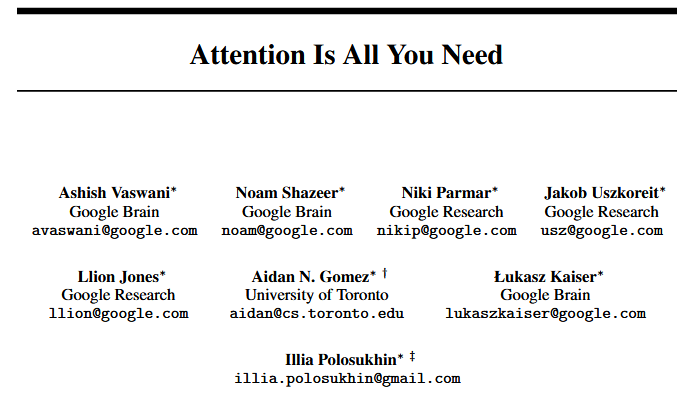

# Transformer Exploration
> Transformers and Transformer Accessories

<!-- [![NPM Version][npm-image]][npm-url]
[![Build Status][travis-image]][travis-url]
[![Downloads Stats][npm-downloads]][npm-url] -->

This repository contains implementations of transformers and transformer-related architectures. Improvements and additions to the architecture that have been researched and published throughout the years since Attention Is All You Need was published will also be implemented and tested.



## Installation

git clone this repo:

```
git clone https://github.com/yzsshen/transformer.git
```

install requirements: #TODO
```
pip install -r requirements.txt
```
<!-- OS X & Linux:

```sh
npm install my-crazy-module --save
```

Windows:

```sh
edit autoexec.bat
``` -->

## Usage example

A few motivating and useful examples of how your product can be used. Spice this up with code blocks and potentially more screenshots.


<!-- _For more examples and usage, please refer to the [Wiki][wiki]._ -->

<!-- ## Development setup

Describe how to install all development dependencies and how to run an automated test-suite of some kind. Potentially do this for multiple platforms.

```sh
make install
npm test
``` -->

## Release History

<!-- * 0.2.1
    * CHANGE: Update docs (module code remains unchanged)
* 0.2.0
    * CHANGE: Remove `setDefaultXYZ()`
    * ADD: Add `init()`
* 0.1.1
    * FIX: Crash when calling `baz()` (Thanks @GenerousContributorName!)
* 0.1.0
    * The first proper release
    * CHANGE: Rename `foo()` to `bar()` -->
* 0.0.1
    * Create repository and add README

## Things to Do
* Implement [Transformer](https://arxiv.org/abs/1706.03762)
    * [The Annotated Transformer](http://nlp.seas.harvard.edu/annotated-transformer/)
* Implement [Differential Transformer](https://arxiv.org/abs/2410.05258)
    * https://github.com/microsoft/unilm/tree/master/Diff-Transformer
* Implement [nGPT](https://arxiv.org/abs/2410.01131)
    * https://github.com/NVIDIA/ngpt
* Implement [RoPE](https://arxiv.org/abs/2104.09864)
    * (https://arxiv.org/abs/2410.06205)

## Known Issues
* Needs more transformers 
  * And transformer accessories

## Meta

Yue Shen – yzs.shen@gmail.com
<!-- – [@YourTwitter](https://twitter.com/dbader_org)  -->
Distributed under the MIT license. See ``LICENSE`` for more information.

[https://github.com/yzsshen](https://github.com/yzsshen)

## Contributing

1. Fork it (<https://github.com/yzsshen/transformer/fork>)
2. Create your feature branch (`git checkout -b feature/fooBar`)
3. Commit your changes (`git commit -am 'Add some fooBar'`)
4. Push to the branch (`git push origin feature/fooBar`)
5. Create a new Pull Request

